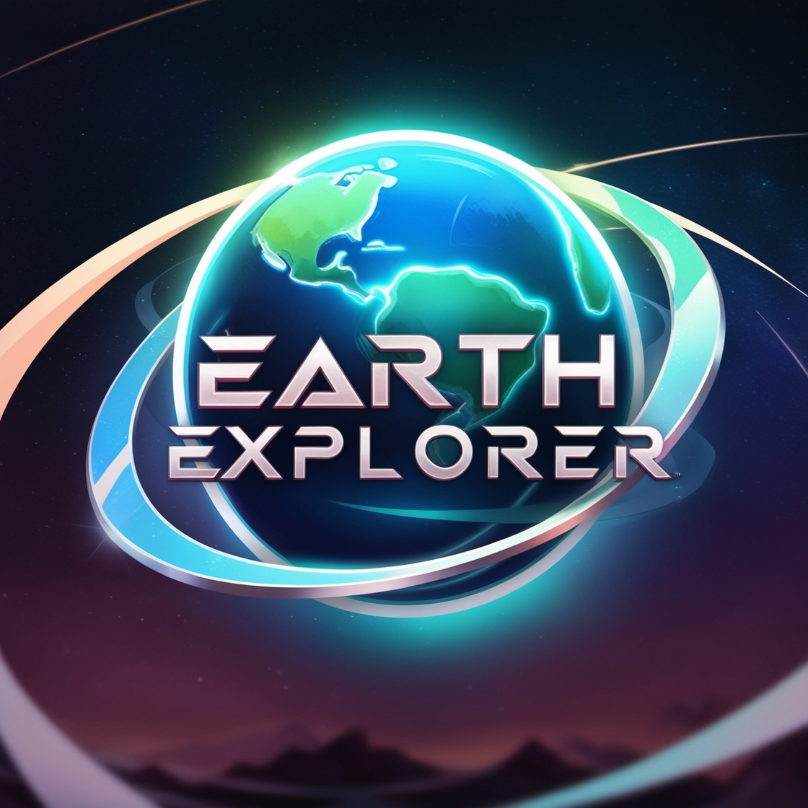
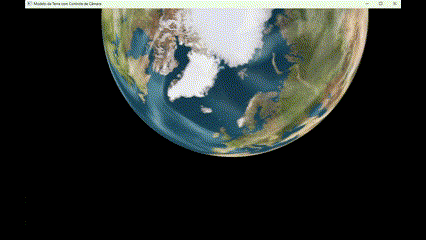

# Earth Explorer 🌍

  

**Earth Explorer** é um jogo 3D que renderiza um modelo detalhado do planeta Terra, permitindo ao usuário explorar o ambiente com controles de teclado e mouse. Navegue pelo espaço, observe o planeta em detalhes e experimente uma simulação envolvente de visualização do nosso mundo em um cenário espacial.

---

## Índice

- [Visão Geral](#visão-geral)
- [Características](#características)
- [Instalação](#instalação)
- [Como Jogar](#como-jogar)
- [Descrição do Cenário](#descrição-do-cenário)
- [Solução de Problemas](#solução-de-problemas)

---

## Visão Geral

O **Earth Explorer** utiliza OpenGL e bibliotecas modernas como GLFW, GLEW, GLM e Assimp para criar uma experiência visual imersiva e responsiva. Com controles simples e um design limpo, você pode explorar o planeta Terra em um cenário dinâmico e fascinante.

  

---

## Características

- **Renderização Realista da Terra**: O jogo utiliza texturas de alta definição e um modelo 3D detalhado do planeta Terra.
- **Controles Responsivos**: Controle a câmera com precisão usando teclado e mouse.
- **Exploração Espacial**: Movimente-se livremente pelo ambiente em primeira pessoa.
- **Iluminação Dinâmica**: Simula a luz do sol para criar um efeito visual impressionante.
- **Facilidade de Configuração**: O projeto inclui dependências organizadas e um guia de instalação simples.

---

## Instalação

### Pré-requisitos

Certifique-se de que você tenha os seguintes softwares instalados:

- **CMake** (versão 3.12 ou superior)
- **Compilador C++** (compatível com C++17, como GCC, Clang ou MSVC)
- **Git** (para clonar o repositório)

### Clonar o Repositório

Abra um terminal e execute:

git clone https://github.com/LucasCadaval/ProjetoFinalCG.git  
cd ProjetoFinalCG

### Configurar o Ambiente e Executar o Jogo

1. Abra a pasta "ProjetoFinalCG" com o Visual Studio 2022

2. Espere a geração do CMake:
   1> Geração de CMake concluída.

3. Execute o projeto:
   ProjetoFinalCG.exe

---

## Como Jogar

### Controles do Teclado

- **W**: Move para frente
- **S**: Move para trás
- **A**: Move para a esquerda
- **D**: Move para a direita
- **ESC**: Fecha o jogo

### Controles do Mouse

- **Movimento do Mouse**: Gira a câmera para observar o ambiente
- **Roda do Mouse**: Ajusta o zoom da visão

---

## Descrição do Cenário

- **Planeta Terra**: Um modelo 3D detalhado com texturas realistas representando continentes e oceanos.
- **Cenário Espacial**: Um plano de fundo temático que simula o espaço sideral.
- **Iluminação Dinâmica**: Simula a luz do sol, destacando a superfície da Terra e criando sombras suaves.

---

## Solução de Problemas

### Problemas Comuns

1. **Erro no Caminho dos Arquivos**:
   - Certifique-se de mudar o caminho dos arquivos em `main.cpp`.
   - Confirme que o caminho para a textura e o objeto esteja correto para o seu computador (Ex.: `<Seu Caminho>/ProjetoFinalCG/earth/13902_Earth_v1_l3.obj`).

2. **Erro ao Carregar Textura**:
   - Certifique-se de que `Earth_diff.jpg` esteja na pasta `textures/`.
   - Confirme que o caminho para a textura no código está correto.

3. **Modelo Não Carrega**:
   - Verifique se o arquivo `13902_Earth_v1_l3.obj` está na pasta `models/`.
   - Certifique-se de que a biblioteca Assimp está corretamente configurada.

4. **Erro de DLL Faltando no Windows**:
   - Confirme que `glew32.dll` e `assimp-vc143-mt.dll` estão no mesmo diretório do executável.

---
